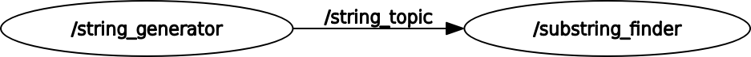
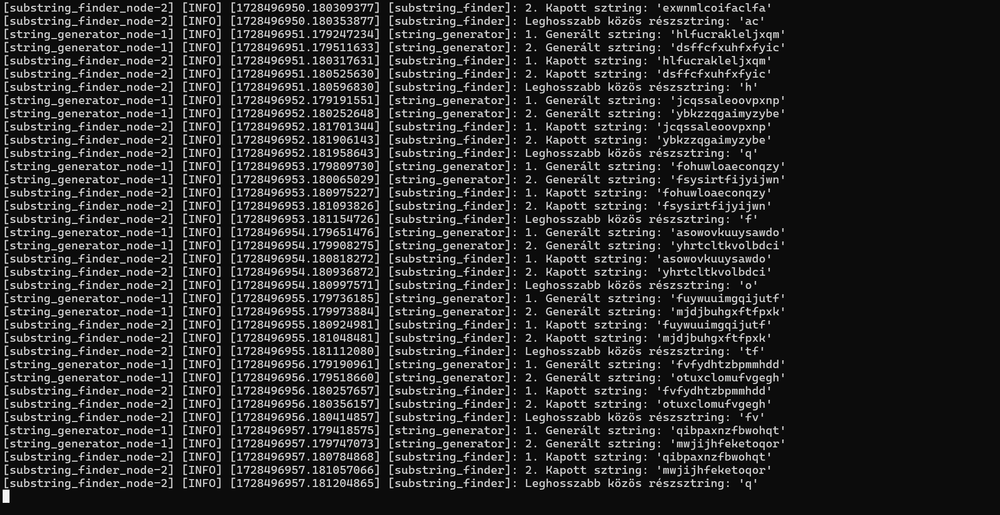

# `kov_evl_longestsubstring` package
ROS 2 C++ package.  [](https://docs.ros.org/en/humble/)

A package két node-ot tartalmaz, a `/string_generator` és `/substring_finder` nodeok közös csatornán kommunikálnak, jelen esetben egy `string_topic` - on. 

A `/string_generator` publisher node szerepet tölt be, azaz két random generált sztringet hirdet a `string_topic`-on, amire a `/substring_finder` feliratkozik. A `/substring_finder` node a két sztring (ami valójában csak egy hosszabb elfelezett sztring) lehosszabb közös résztringjét keresi meg, majd az az outputra kiírja.

A csomag megvalósítása `ROS 2 Humble` -ben történt. 

## Packages and build

It is assumed that the workspace is `~/ros2_ws/`.

### Clone the packages
``` r
cd ~/ros2_ws/src
```
``` r
git clone https://github.com/kopaj/kov_evl_longestsubstring
```

### Build ROS 2 packages
``` r
cd ~/ros2_ws
```
``` r
colcon build --packages-select kov_evl_longestsubstring --symlink-install
```

<details>
<summary> Don't forget to source before ROS commands.</summary>

``` bash
source ~/ros2_ws/install/setup.bash
```
</details>

``` r
ros2 launch kov_evl_longestsubstring launch_file.py
```

## Graph

Az alábbi képen a csomag struktúráját leíró `gráf` látható.



Ez a `kimenet` futás közben: 


